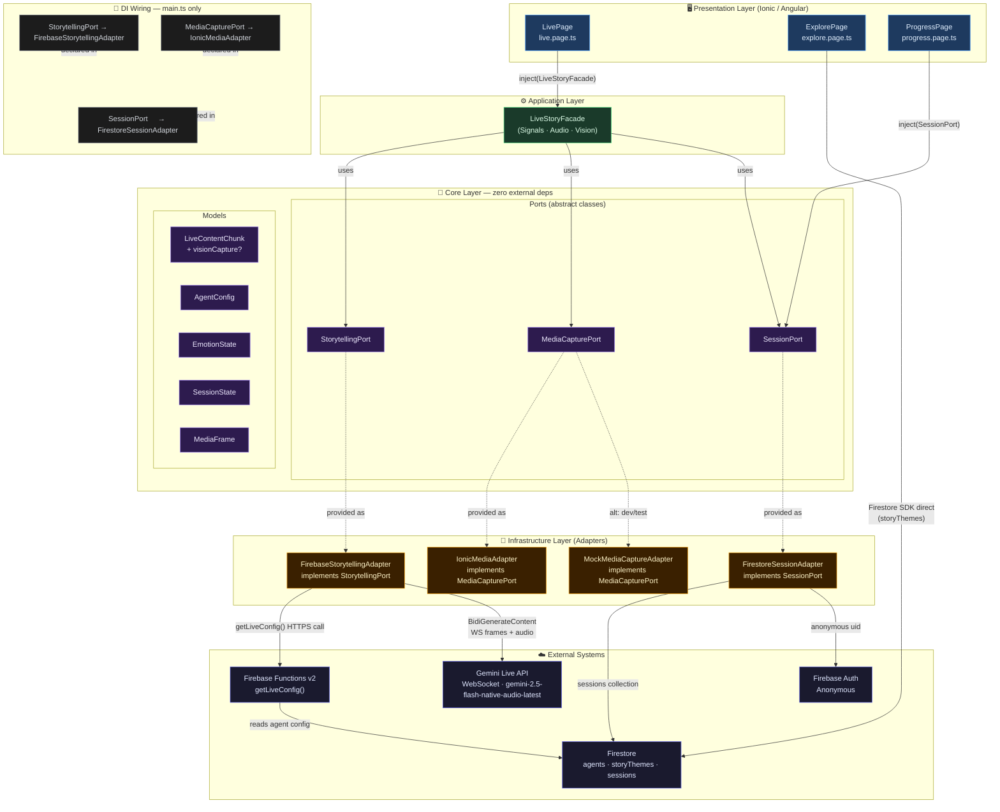
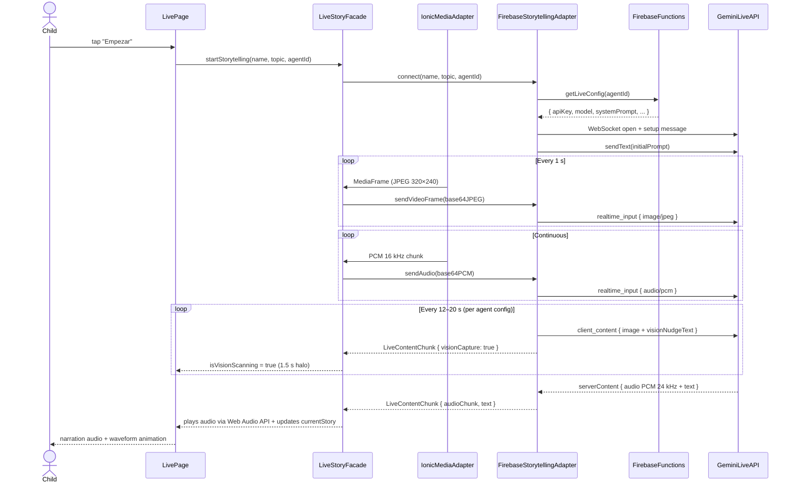
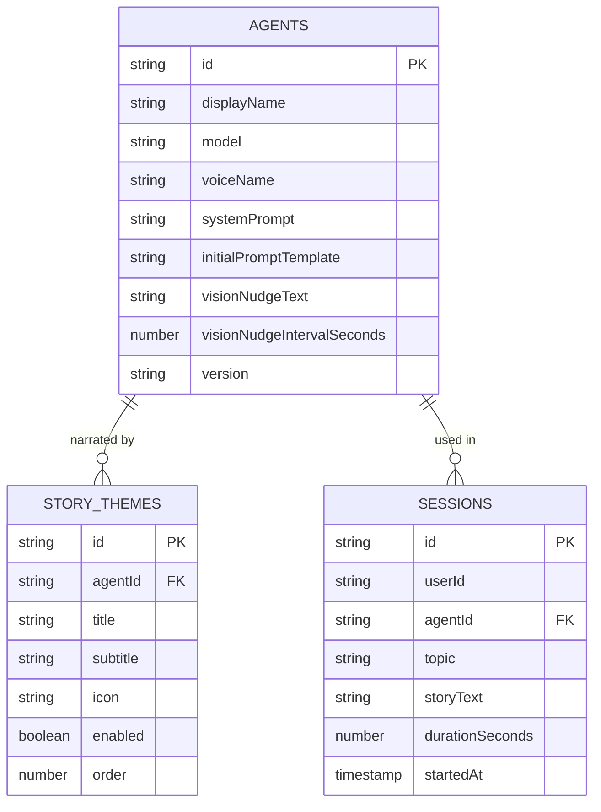

# Cuentopia Live Agent — Architecture

## Hexagonal Architecture Overview

---

## Real-time Data Flow

---

## Firestore Collections

---

## Agent Roster

| Agent ID | Persona | Voice | Nudge interval |
|---|---|---|---|
| `narrator-onboarding` | Cuentopia (welcome flow) | Puck | 15 s |
| `narrator-default` | Leo, el Cuentista | Puck | 12 s |
| `narrator-fears` | Valentín, el Guardián | Kore | 10 s |
| `narrator-sleep` | Luna, Tejedora de Sueños | Aoede | 20 s |
| `narrator-adventure` | Chispa, la Exploradora | Fenrir | 10 s |
